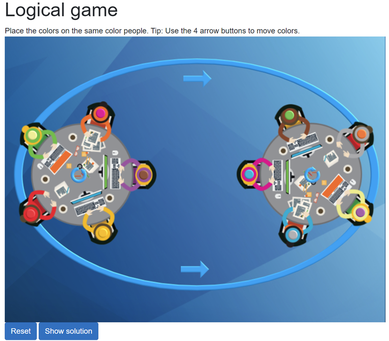
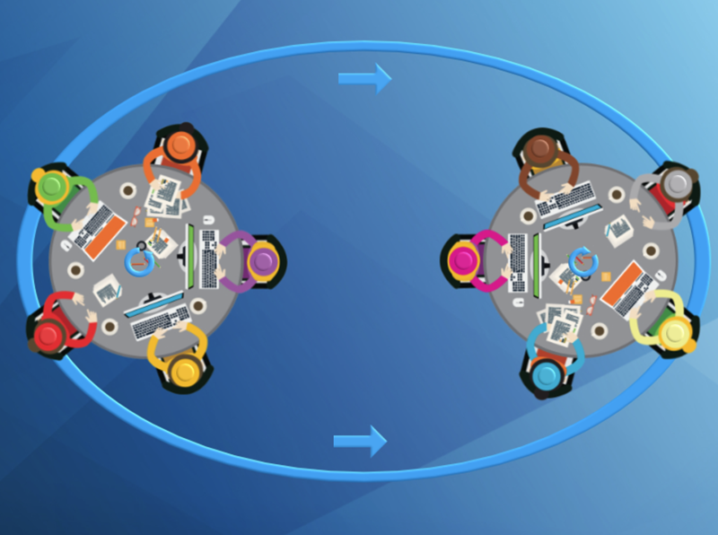
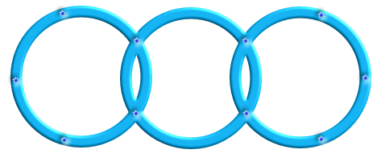
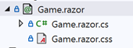

# Blazor Logical Game
## Overview
Sometimes one can ask - is it possible to use Blazor for simple game?
And there is a yes to answer that question. [Demo application](https://logicalgame202401.azurewebsites.net)

## Description
Here is the main page.
You will see 10 colored people with 10 colored "hats". Your goal is to move the hats to the corresponding colored people with 4 buttons. There are additional buttons for Initial Reset and Show Solution.


Here is your target:

Here is another way of looking at it, where you can have a better idea of the movement.

## Possible technical problems
### Blazor .NET 8.0 Home page Autorender mode
If you have a client and a server part, you cannot have 2 home pages.
And the server part must have a home page. If you want to have a client homepage and use autorender mode, you can use some tricks.
1. Navigate from server home page to client home page:

```charp
@page "/"
@inject NavigationManager NavigationManager

<PageTitle>Server Home page</PageTitle>

@code {
    protected override async Task OnInitializedAsync()
    {
        await base.OnInitializedAsync();
        NavigationManager.NavigateTo("/client_homepage");
    }
}
```

2. Use component instead of page

```charp
@page "/"

@* <PageTitle>Server Home page</PageTitle> *@
<ClientHomePageComponent/>

```
### Blazor CSS isolation doesn't work for controls within a page.
Sometimes you just want to use CSS for a single page.

And sometimes you want to use the same CSS style in a child control, but it does not work.
Solution is easy - use **::deep**
`::deep .btn-position1 {...}`

### I need a background image behind my controls on a Blazor page

The solution is to use a CSS class. Height and width can be set using a div tag or CSS class attributes.
```html
<div class="page-background" style="height: 600px; width: 800px;">
...your controls....
</div>
```

```css
.page-background {
    background-image: url(./images/my-background.jpg)
}
```
### How can I move controls by pixels?
You must use CSS with the [position](https://developer.mozilla.org/en-US/docs/Web/CSS/position) attribute.
If you have more than one element then put them all in default positions and then arrange them one by one.

```html
<div class="position01">
...
</div>

```
```css
.position01 {
        position: relative;
        left: 48px;
        top: 194px;
}

```